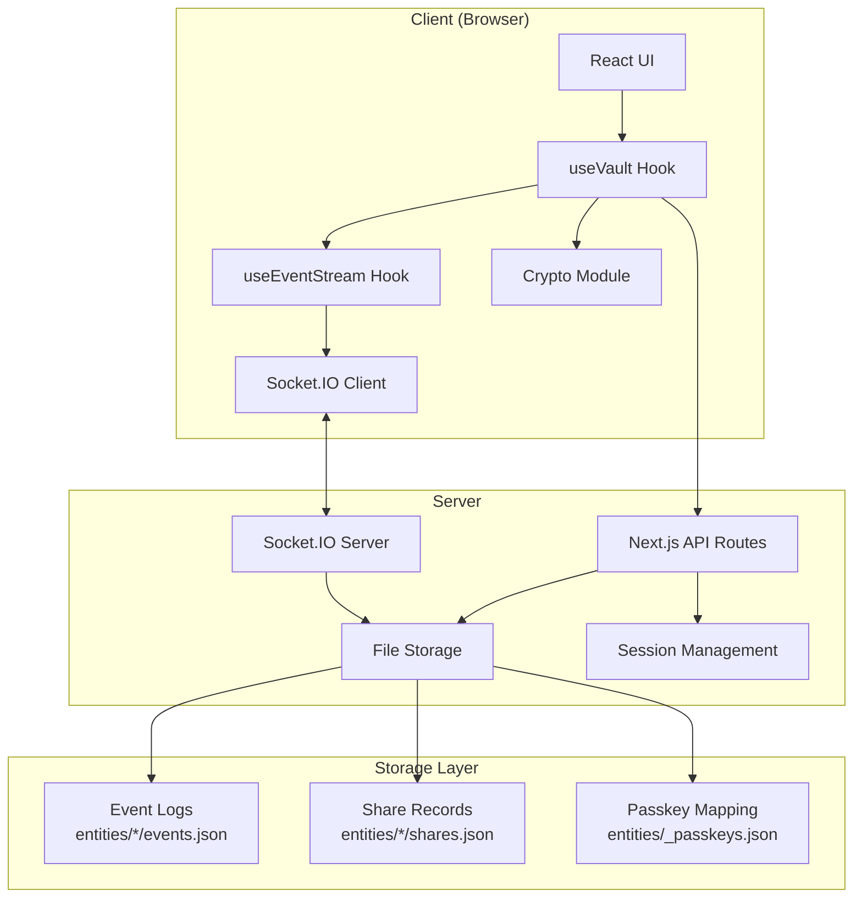
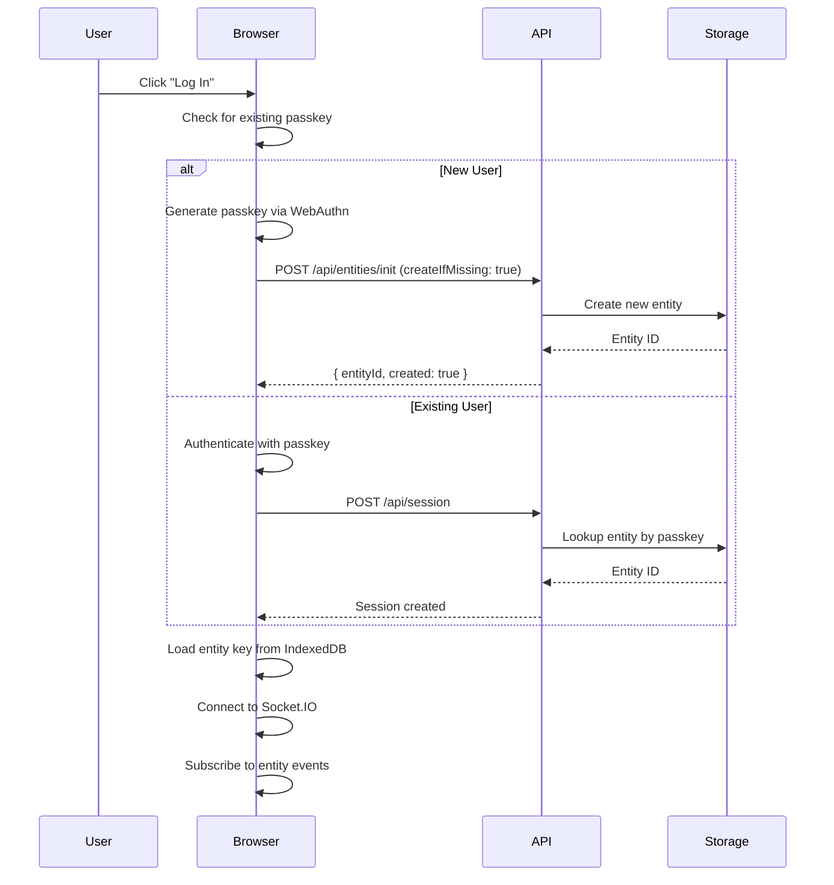
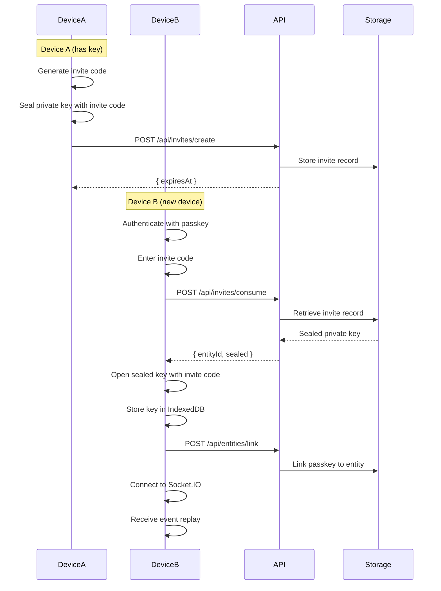
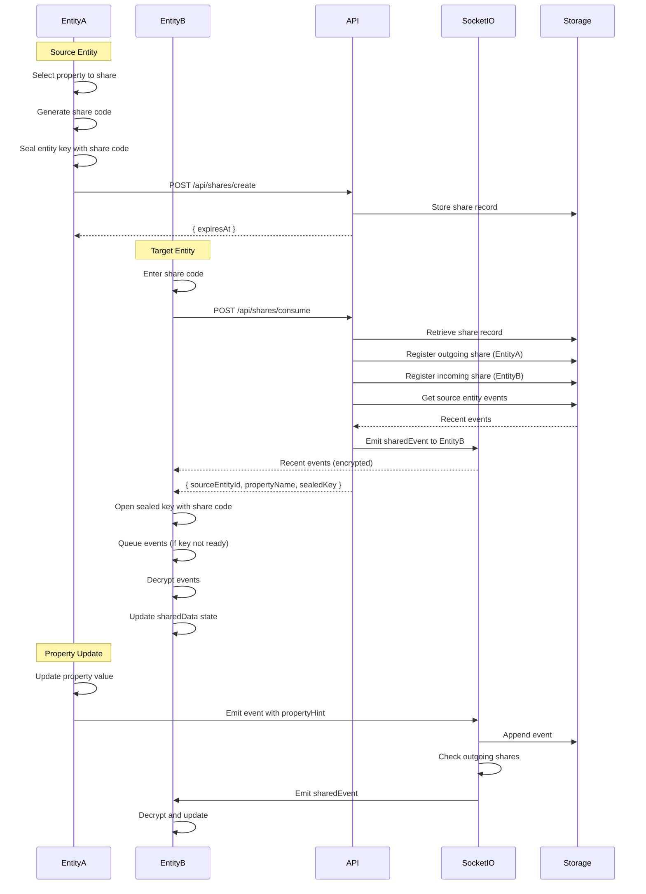
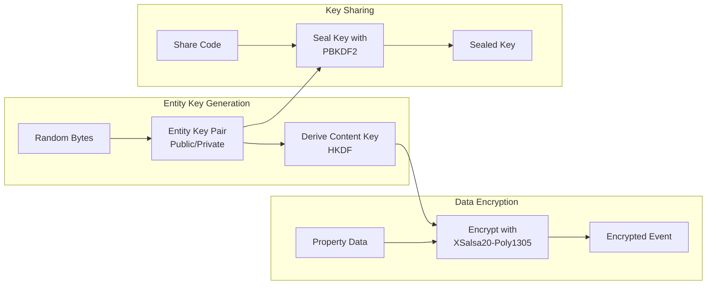
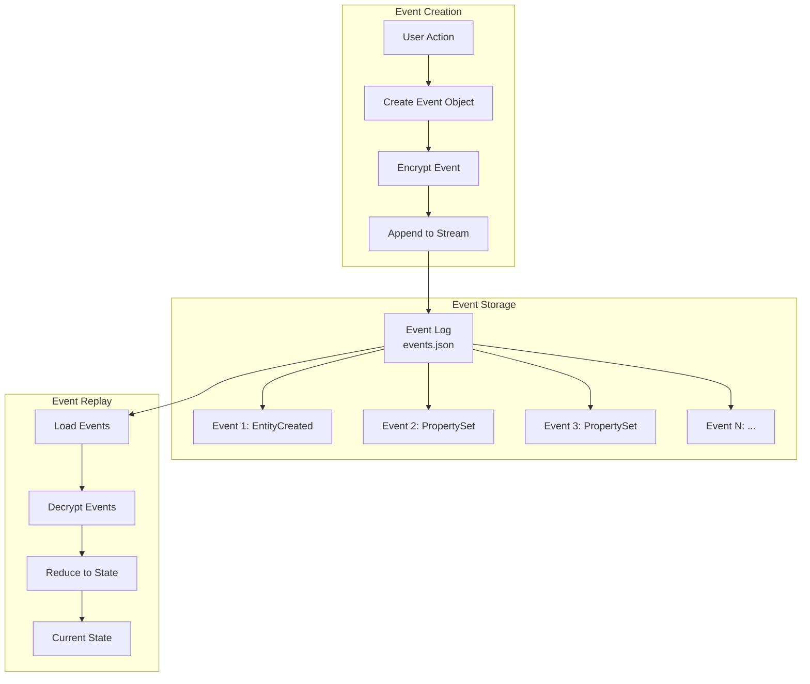

# TrueTrace Vault

A secure, end-to-end encrypted vault application with passkey authentication, real-time synchronization, and property sharing capabilities. Built with Next.js, Socket.IO, and libsodium for maximum security and privacy.

## Features

- 🔐 **Passkey Authentication** - Secure, passwordless authentication using WebAuthn
- 🔒 **End-to-End Encryption** - All data encrypted client-side with libsodium (XSalsa20-Poly1305)
- 📱 **Multi-Device Support** - Link multiple devices to the same vault
- ⚡ **Real-Time Sync** - Instant synchronization across all devices via Socket.IO
- 🔗 **Property Sharing** - Share specific properties with other entities securely
- 📊 **Event-Sourced Architecture** - Immutable event log for auditability and consistency
- 🎨 **Modern UI** - Clean, responsive interface with dark theme

## Architecture Overview



## System Components

### Client-Side

- **React UI Components** - User interface built with React 19
- **useVault Hook** - Main state management and business logic
- **useEventStream Hook** - Real-time event synchronization
- **Crypto Module** - Encryption/decryption using libsodium
- **Socket.IO Client** - WebSocket connection for real-time updates

### Server-Side

- **Next.js API Routes** - REST endpoints for authentication, entities, shares
- **Socket.IO Server** - WebSocket server for event broadcasting
- **File Storage** - JSON-based file storage for events and metadata
- **Session Management** - Iron-session for secure session handling

## Authentication Flow



## Device Linking Flow



## Property Sharing Flow



## Encryption Architecture



## Event Sourcing Flow



## Installation

### Prerequisites

- [Bun](https://bun.sh) (package manager and runtime)
- Node.js 18+ (if not using Bun runtime)

### Setup

```bash
# Clone the repository
git clone <repository-url>
cd truetrace

# Install dependencies
bun install

# Start development server
bun run dev
```

The application will be available at `http://localhost:3000`.

## Project Structure

```
truetrace/
├── app/
│   ├── api/                 # Next.js API routes
│   │   ├── _lib/           # Storage utilities
│   │   ├── admin/          # Admin endpoints
│   │   ├── entities/       # Entity management
│   │   ├── invites/        # Device linking
│   │   ├── shares/         # Property sharing
│   │   └── session/        # Session management
│   ├── components/         # React components
│   │   ├── CopyableEntityId.tsx
│   │   ├── DevicesSection.tsx
│   │   ├── LoginView.tsx
│   │   ├── PropertiesSection.tsx
│   │   ├── SettingsSection.tsx
│   │   ├── SharingSection.tsx
│   │   └── Sidebar.tsx
│   ├── hooks/              # React hooks
│   │   ├── useEventStream.ts
│   │   └── useVault.ts
│   ├── lib/                # Core libraries
│   │   ├── api.ts          # API client
│   │   ├── crypto.ts       # Encryption utilities
│   │   ├── events.ts       # Event handling
│   │   ├── session.ts      # Session utilities
│   │   └── socket.ts       # Socket.IO instance
│   ├── globals.css         # Global styles
│   ├── layout.tsx          # Root layout
│   ├── page.tsx            # Main page
│   └── providers.tsx       # React Query provider
├── entities/               # Data storage (gitignored)
│   ├── _passkeys.json     # Passkey to entity mapping
│   ├── _shares.json        # Share codes
│   └── {entityId}/        # Per-entity data
│       ├── events.json     # Event log
│       └── shares.json     # Share records
├── server.ts               # Custom Next.js server with Socket.IO
├── package.json
├── tsconfig.json
└── README.md
```

## Usage

### First Time Setup

1. **Login**: Click "Log In" and authenticate with your device's passkey (Touch ID, Face ID, Windows Hello, etc.)
2. **Create Properties**: Add key-value pairs in the Properties section
3. **Link Devices**: Generate an invite code in the Devices section and use it on another device

### Sharing Properties

1. **Create Share**: Select a property in the Sharing section and click "Create Share"
2. **Copy Share Code**: Copy the generated share code (expires after a set time)
3. **Accept Share**: On another entity, paste the share code in the "Accept a Share" section
4. **Real-Time Updates**: Changes to shared properties sync automatically

### Security Features

- **Zero-Knowledge Architecture**: Server never sees plaintext data
- **Client-Side Encryption**: All encryption/decryption happens in the browser
- **Secure Key Storage**: Entity keys stored encrypted in IndexedDB
- **Passkey Authentication**: No passwords to compromise
- **Share Expiration**: Share codes expire automatically

## API Endpoints

### Authentication
- `POST /api/session` - Create session
- `DELETE /api/session` - Clear session
- `GET /api/session` - Get current session

### Entities
- `POST /api/entities/init` - Initialize or create entity
- `POST /api/entities/link` - Link passkey to entity

### Invites
- `POST /api/invites/create` - Create device invite
- `POST /api/invites/consume` - Consume invite code

### Shares
- `POST /api/shares/create` - Create property share
- `POST /api/shares/consume` - Accept share code
- `POST /api/shares/revoke` - Revoke a share
- `GET /api/shares` - Get all shares

### Admin
- `POST /api/admin/reset` - Reset all data (development only)

## Socket.IO Events

### Client → Server
- `subscribe` - Subscribe to entity's event stream
- `unsubscribe` - Unsubscribe from entity
- `append` - Append new encrypted event

### Server → Client
- `replay` - Replay all existing events on subscribe
- `event` - New event for subscribed entity
- `sharedEvent` - Shared event from another entity
- `error` - Error message

## Security Considerations

### Encryption
- **Algorithm**: XSalsa20-Poly1305 (authenticated encryption)
- **Key Derivation**: HKDF for content keys, PBKDF2 for share/invite keys
- **Nonce**: Random nonce per encryption operation

### Key Management
- Entity private keys never leave the client unencrypted
- Keys wrapped with device-specific keys stored in IndexedDB
- Share keys sealed with share codes (PBKDF2)
- Invite keys sealed with invite codes (PBKDF2)

### Threat Model
- **Server Compromise**: Server cannot decrypt user data
- **Network Interception**: All data encrypted in transit (HTTPS) and at rest
- **Client Compromise**: Device keys protect entity keys
- **Share Code Leakage**: Share codes expire and are single-use

## Development

### Running in Development

```bash
bun run dev
```

### Building for Production

```bash
bun run build
bun run start
```

### Environment Variables

No environment variables required for basic operation. The server runs on `localhost:3000` by default.

## Technology Stack

- **Framework**: Next.js 16 (App Router)
- **Runtime**: Bun
- **UI**: React 19
- **State Management**: React Query (TanStack Query)
- **Real-Time**: Socket.IO
- **Encryption**: libsodium-wrappers-sumo
- **Authentication**: @simplewebauthn/browser
- **Storage**: IndexedDB (idb-keyval), File System (JSON)
- **Styling**: CSS Modules with custom properties

## License

[Add your license here]

## Contributing

[Add contribution guidelines here]

## Acknowledgments

- Built with security and privacy as core principles
- Uses industry-standard encryption libraries (libsodium)
- Follows WebAuthn standards for passkey authentication
